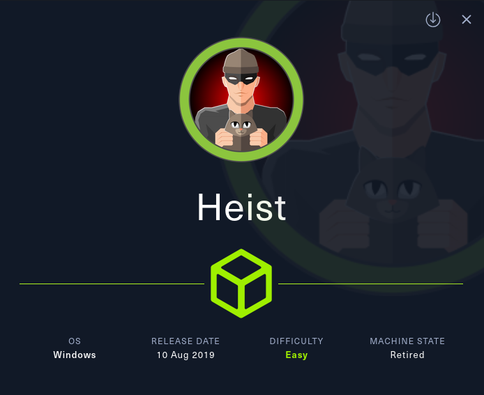
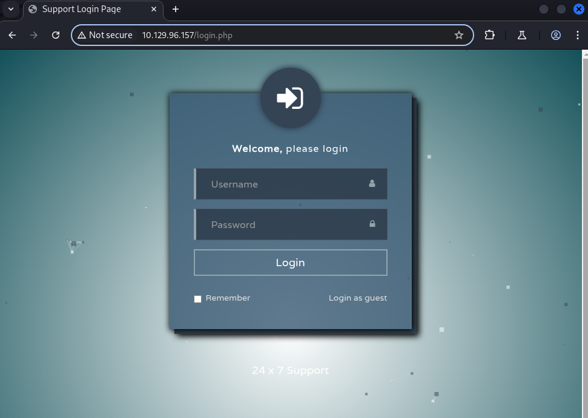
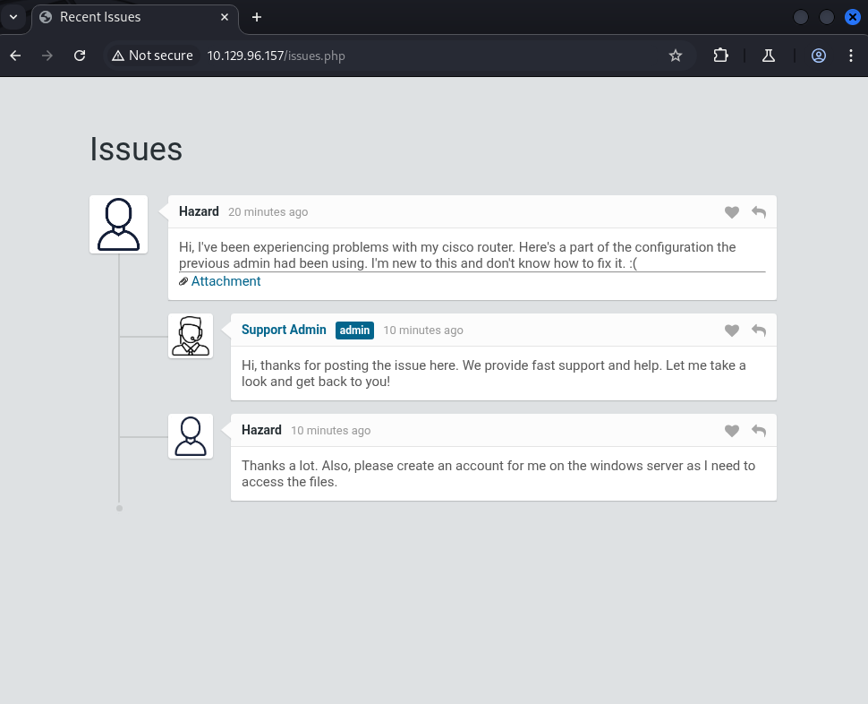
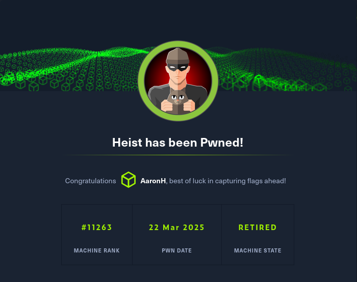

# HEIST



This report walks through the compromise of the **Heist** machine on HackTheBox. By extracting and cracking router configuration passwords, we gain user access, then pivot through enumeration and password spraying to obtain a second user’s credentials. Finally, local log analysis reveals domain administrator credentials, resulting in full system compromise.

## Reconnaissance and Enumeration

An initial Nmap scan showed **port 80 (HTTP)** and other Windows services including **RPC**, **SMB**, and **WinRM**.

```sh
❯ sudo nmap -sC -sV -T4 -oA nmap_results 10.129.96.157
...
PORT     STATE SERVICE       VERSION
80/tcp   open  http          Microsoft IIS httpd 10.0
135/tcp  open  msrpc         Microsoft Windows RPC
445/tcp  open  microsoft-ds  Windows 10 Pro 17763 microsoft-ds (workgroup: SupportDesk)
5985/tcp open  http          Microsoft HTTPAPI httpd 2.0 (SSDP/UPnP)
...
```

Navigating to `http://10.129.96.157` brought up a **Support Login** portal.



Logging in as `guest`, we found a **message from Hazard** requesting a new account, along with an **attachment**.



## Credential Discovery in Router Configuration

The linked attachment pointed to `http://10.129.96.157/attachments/config.txt`, which was a **Cisco router configuration file** containing encrypted passwords.

### Decrypted Credentials

- Cisco Type 7 Passwords:
  - `rout3r:$uperP@ssword`
  - `admin:Q4)sJu\Y8qz*A3?d`

- Cisco Type 5 Password (hashed with MD5, `$1$` format):
  - `stealth1agent` (hash cracked via hashcat)

---

### **Did You Know? – Cisco Passwords**

> Cisco routers can store passwords in **Type 7** (reversible XOR encryption) or **Type 5** (MD5 hashes). Type 7 passwords are easily cracked with known algorithms. Type 5 hashes require cracking tools like **hashcat**.

---

## Attempted Logins and RPC Access

While **WinRM login with Hazard's credentials failed**, we successfully connected using **RPC**:

```sh
❯ rpcclient -U 'hazard%stealth1agent' 10.129.96.157
rpcclient $> getusername
Account Name: Hazard, Authority Name: SUPPORTDESK
```

Unfortunately, we could not enumerate domain users with `enumdomusers`. However, we used **SID enumeration** as a workaround.

By obtaining Hazard's SID and iterating through possible RIDs, we discovered additional valid usernames:

```txt
Hazard
support
Chase
Jason
```

---

### Password Spraying Success

We **sprayed the decrypted passwords** against the enumerated users and hit a match:

```txt
Chase:Q4)sJu\Y8qz*A3?d
```

---

### **Did You Know? – Password Reuse**

> Password reuse between devices and accounts is a common misconfiguration. Using the same password for **network equipment** and **user accounts** can expose an organization to significant risk when one system is compromised.

## Gaining User Access

Using **Chase’s credentials**, we connected via **WinRM**:

```sh
❯ evil-winrm -i 10.129.96.157 -u chase -p 'Q4)sJu\Y8qz*A3?d'
```

User flag obtained:

```powershell
*Evil-WinRM* PS C:\Users\Chase\Desktop> type user.txt
820ba9be77fc7354d032f322364ccb8a
```

A note on Chase’s desktop mentioned restricted guest access and router configuration.

## Privilege Escalation to Administrator

While exploring the system, we found a **Firefox Maintenance Log** that revealed admin credentials embedded in a software update URL:

```powershell
localhost/login.php?login_username=admin@support.htb&login_password=4dD!5}x/re8]FBuZ&login=
```

Logged in via WinRM as Administrator:

```sh
❯ evil-winrm -i 10.129.96.157 -u Administrator -p '4dD!5}x/re8]FBuZ'
```

Root flag obtained:

```powershell
*Evil-WinRM* PS C:\Users\Administrator\Desktop> type root.txt
5ed79b9116fe5c4122e3918cb8428113
```



---

## Findings and Remediation

### Findings

- **Sensitive Credentials in Config Files**: Reversible and hashed passwords were stored insecurely in a public attachment.
- **Password Reuse**: Router password reused by a domain user.
- **SID Enumeration Enabled**: Allowed user discovery via RPC.
- **Credentials Leaked in Logs**: Admin password exposed in Firefox Maintenance log.

### Remediation

- **Secure Credential Storage**: Avoid sharing or storing sensitive config files on accessible platforms.
- **Unique Passwords**: Enforce unique passwords for devices and user accounts.
- **Restrict RPC Enumeration**: Harden systems to prevent SID and user enumeration over RPC.
- **Log Hygiene**: Avoid embedding credentials in command-line logs or system logs.

## Lessons Learned

Heist highlights real-world risks from poor credential handling, password reuse, and weak logging practices. Even without initial access, decrypted passwords and enumeration techniques allowed for pivoting and privilege escalation. Proper password management and system hardening are key to defense.

## Resources

- [HackTheBox - Heist CTF](https://app.hackthebox.com/machines/201)
- [Cisco Password Types Explained](https://community.cisco.com/t5/networking-knowledge-base/understanding-the-differences-between-the-cisco-password-secret/ta-p/3163238)
- [SID Enumeration Techniques](https://www.hackingarticles.in/active-directory-enumeration-rpcclient/)

---

[⬅ Back to Home](/CTF-Reports/)
