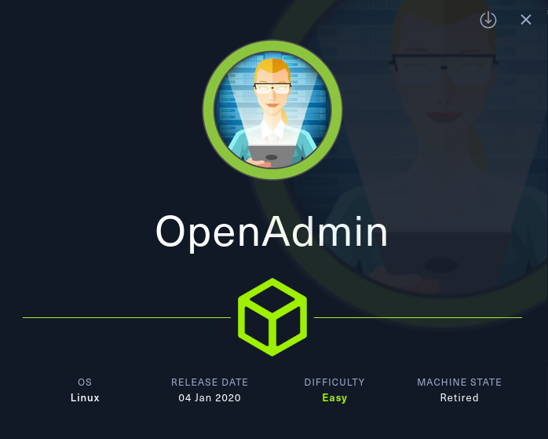
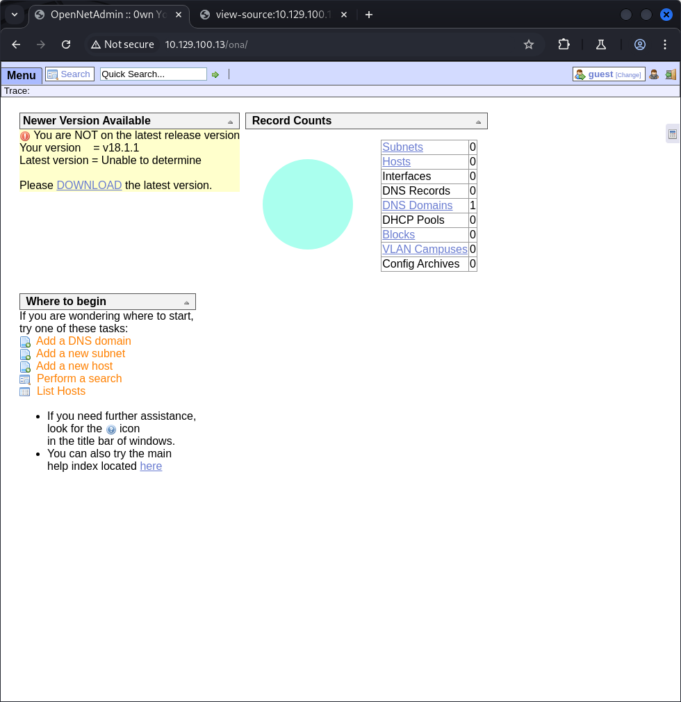
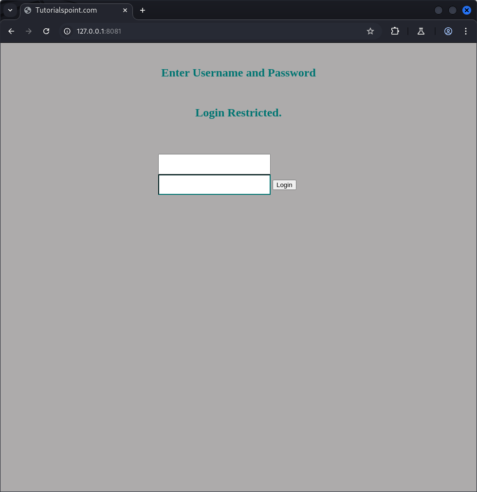
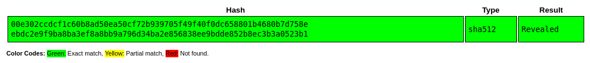
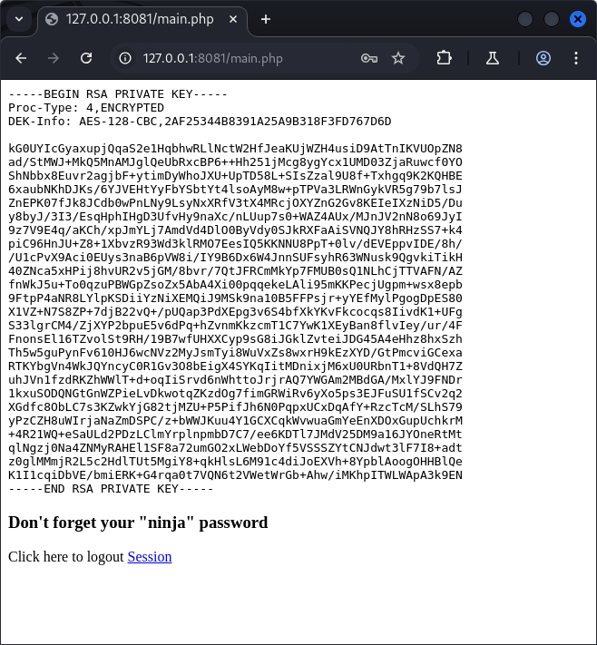
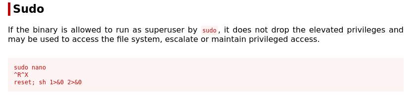
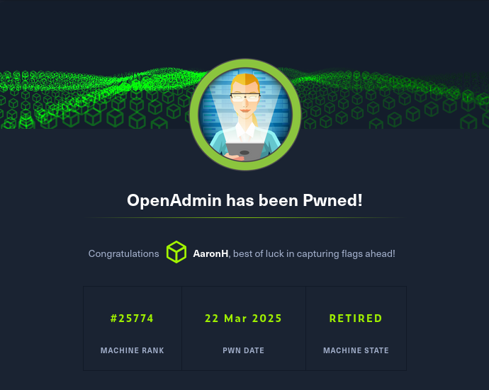

# OpenAdmin



OpenAdmin is a Linux box hosting a vulnerable version of OpenNetAdmin. By exploiting a command injection flaw in the web app, we gained remote code execution and extracted database credentials. These credentials were reused to SSH in as a user. After discovering an internal site and cracking an encrypted SSH key, we escalated privileges to root by abusing passwordless `sudo` access to `nano`.

## Initial Access

A basic **nmap** scan showed two open services:

```sh
22/tcp open  ssh     OpenSSH 7.6p1 Ubuntu
80/tcp open  http    Apache httpd 2.4.29 (Ubuntu)
```

Fuzzing with `ffuf` revealed hidden directories:

```sh
/artwork
/music
/sierra
/ona
```

Inspecting the `/music` page source disclosed a link to `/ona`, hosting **OpenNetAdmin v18.1.1**.



## Exploiting OpenNetAdmin for RCE

**OpenNetAdmin v18.1.1** suffers from [unauthenticated command injection](https://www.exploit-db.com/exploits/47691) via the `xajaxargs[]` parameters. A crafted POST request allowed command execution on the server:

```sh
$ whoami
www-data
```

### **Did You Know? - OpenNetAdmin v18.1.1**

> OpenNetAdmin v18.1.1 allows unauthenticated **command injection** via its web interface. This vulnerability occurs because user-supplied input is passed directly to system commands without proper validation, letting attackers inject commands with a simple `;`. It’s a classic example of **improper input sanitization**—a common pitfall in older PHP apps.

A PHP reverse shell was uploaded, granting better control over the system.

## Password Reuse: ona_sys → jimmy

Reading `/opt/ona/www/local/config/database_settings.inc.php` revealed credentials:

```txt
ona_sys : n1nj4W4rri0R!
```

SSH access as **jimmy** was possible using these same credentials.

## Internal Web App & SSH Key Disclosure

Reviewing `/etc/apache2/sites-available/internal.conf` showed an internal site running as **joanna** on localhost port 52846. SSH port forwarding allowed access in-browser:

```sh
ssh -L 8081:127.0.0.1:52846 jimmy@10.129.100.13
```



Inspecting the site’s PHP source code revealed that it expected jimmy’s credentials, verifying the password with a **SHA512 hash**. 

```sh
cat /var/www/internal/index.php
...
if ($_POST['username'] == 'jimmy' && hash('sha512',$_POST['password']) == '00e302ccdcf1c60b8ad50ea50cf72b939705f49f40f0dc658801b4680b7d758eebdc2e9f9ba8ba3ef8a8bb9a796d34ba2e856838ee9bdde852b8ec3b3a0523b1') {
$_SESSION['username'] = 'jimmy';
header("Location: /main.php");
...
```

Cracking this hash revealed the password `Revealed`, granting access to the internal dashboard.



The internal site revealed **joanna**’s **encrypted private key**.



Using `ssh2john` and `john`, the passphrase **bloodninjas** was cracked. The key was then decrypted with `openssl`, and SSH access was gained as **joanna**.

## Privilege Escalation to Root

Joanna had passwordless `sudo` access to **nano**:

```sh
(ALL) NOPASSWD: /bin/nano /opt/priv
```

Using **GTFOBins**, root access was achieved by opening `/opt/priv` in `nano`, then executing a shell.



```sh
# Inside nano:
^R^X
reset; sh 1>&0 2>&0

> id             
uid=0(root) gid=0(root) groups=0(root)                                                                                
> cat /root/root.txt
6272d939337c03ad4e5b78068a62d71e
```



## Findings and Remediation

### Findings

- Remote Code Execution via OpenNetAdmin
- Reused credentials for SSH login
- Disclosure of encrypted SSH key through web app
- Weak passphrase on SSH key
- Unrestricted `sudo` access to `nano`

### Remediation

- Patch OpenNetAdmin to the latest version
- Implement unique credentials for services and users
- Secure SSH keys and avoid exposing private keys
- Enforce strong SSH key passphrases
- Restrict sudo access; avoid NOPASSWD where possible
- Audit internal web applications for sensitive disclosures

### Lessons Learned

- Always inspect config files for hardcoded credentials—they’re often reused elsewhere.
- Encrypted SSH keys aren’t a dead-end. If exposed, they can be cracked if the passphrase is weak.
- Don’t overlook internal web apps—port forwarding can expose critical paths to escalation.
- GTFOBins is an invaluable resource for privilege escalation when given sudo access to benign tools.

### Resources

- [HackTheBox Machine - OpenAdmin](https://app.hackthebox.com/machines/222)
- [OpenNetAdmin RCE Exploit](https://www.exploit-db.com/exploits/47691)
- [GTFOBins - nano](https://gtfobins.github.io/gtfobins/nano/)

---

[⬅ Back to Home](/CTF-Reports/)
